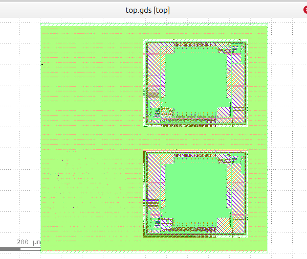

## William's Final Year Project

**Target:**  
5‑stage pipelined, superscalar (partial 2‑issue), in‑order RISC‑V design with cache, branch prediction, and hazard control unit.

---

## Progress

### Version 1 – Single‑Cycle RV32I

- Finished RTL coding
- Functional verification completed
- Coremark/Mhz = 1.15 (via verilator simulation)
- OpenLane flow completed
- CTS STA estimated Fmax: **35 MHz**
- Area: **1000 µm × 1000 µm**
- With two 1 KB on‑board SRAMs (IMEM/DMEM)

#### Single‑Cycle RV32I GDS View

---

### Version 2 – 5‑Stage Pipelined CPU with Hazard Control Unit, Forwarding Logic, and Branch Prediction

- Converted single‑cycle CPU to a **5‑stage pipeline**
- Added pipeline registers
- Implemented bypass logic in the register file
- Initial Functional Verification Finsihed
- Pass Coremark benchmarking. Coremark/Mhz = 0.7 (IPC dropped due to the penalty of branch flushing etc.)
- Working on the OpenLane Flow 
---

### Version 3 – 5‑Stage Pipeline RV32I with Cache

- **Not started yet**  
- Planned features: instruction/data cache and cache controller

---

### Version 4 – Partial 2‑Issue Superscalar RV32I

- **Not started yet**  
- Planned features: partial 2‑issue front‑end and extended hazard/forwarding logic

---

**Progress:** To be continued…
